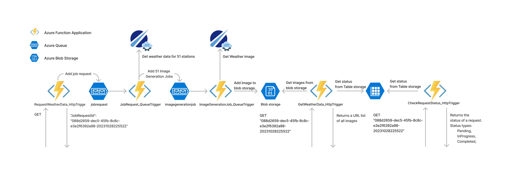
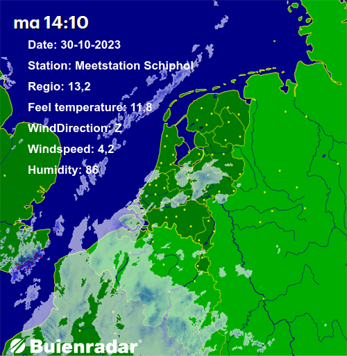

# Azure_Devops_assignment

**Student:** Jaimy Monsuur
**NR:** 668040

## Task Requirements
Using azure functions create an http endpoint which will start a background job that will create multiple images each containing the weather data from a different weather station. ([actual > station measurements] lists 51 different stations so you will generate 51 different images). The initial http endpoint will return a unique id for (or link to) a different endpoint that either list that the jobs are still in progress or a list with links to all the generated images served from the blob storage.

## Must have
* Expose publicly accessible API for requesting a set of fresh images with current weather data using an HttpTrigger.
* Employ QueueTrigger to start the job in the background so the initial call stays fast.
* Employ Blob Storage to store all generated images and to expose the files.
* Employ Buienrader API to get weather station data.
  * [Buienrader API](https://data.buienradar.nl/2.0/feed/json)
* Employ any public API for retrieving an image to write the weather data on.
  * For example, [Unsplash API](https://unsplash.com/developers)
* Expose a publicly accessible API for fetching the generated images using an HttpTrigger.
* Provide exported Postman Collection as API documentation.
  * [Postman Collection](https://learning.postman.com/docs/sending-requests/intro-to-collections/)
* Create a fitting Bicep template (include the queues as well).
* Create a deploy.ps1 script that publishes your code using the .NET CLI, creates the resources in Azure using the Bicep template, and deploys the function using the Azure CLI.
* Employ multiple queues, one for starting the job and one for writing text on a single image.
* Deploy the code to Azure and have a working endpoint.

## Could have
- Use SAS token instead of publicly accessible blob storage for fetching finished image directly from Blob.
- Use authentication on request API. (Be sure to provide me with credentials)
- Provide a status endpoint for fetching progress status and saving status in Table.

## Design



## Requirements checklist
All must haves have been implemented.
The all Could haves have been implemented.
	- Image URI are returned with a SAS token
	- API are hidden behind a access token (AuthorizationLevel.Function)
		- URLToken: ?code=\<Token\>
	- Provide a status endpoint for fetching progress status and saving status in Table.

## Deployment
The application is make in DOTNET 6 isolated. There is a deploy.ps1 that creates the environment using a bicep file. The code can then be pushed using visual studio code 2022.

## Azure deployed endpoints
- https://<Name>.azurewebsites.net/api/RequestWeatherData_HttpTrigger?code=\<Token\>
- https://<Name>.azurewebsites.net/api/GetWeatherData_HttpTrigger/\<JobRequestId\>?code=\<Token\>
- https://<Name>.azurewebsites.net/api/CheckRequestStatus_HttpTrigger/\<JobRequestId\>?code=\<Token\>


## Example Json response
#### RequestWeatherData_HttpTrigger:
```json
{
	"JobRequestId": "088d2659-dec5-45fb-8c8c-e3e2f6392a98-20231028225522",
	"Timestamp": "28/10/2023 22:55:22",
	"BaseUrl": "http://localhost:7187/api/GetWeatherData_HttpTrigger/",
	"JobRequestUrl": "http://localhost:7187/api/GetWeatherData_HttpTrigger/088d2659-dec5-45fb-8c8c-e3e2f6392a98-20231028225522"
}
```
#### GetWeatherData_HttpTrigger:
```json
{
	"BaseSASUri": "http://127.0.0.1:10000/devstoreaccount1/088d2659-dec5-45fb-8c8c-e3e2f6392a98-20231028225522?sv=2023-08-03&st=2023-10-27T23%3A28%3A59Z&se=2023-10-29T23%3A28%3A59Z&sr=c&sp=rl&sig=vHbfFbWyIlEoY%2Fe%2Fx20nGGb4viAkWXkwhTxkGP0YgcQ%3D",
	"ListFilesUri": "http://127.0.0.1:10000/devstoreaccount1/088d2659-dec5-45fb-8c8c-e3e2f6392a98-20231028225522?sv=2023-08-03&st=2023-10-27T23%3A28%3A59Z&se=2023-10-29T23%3A28%3A59Z&sr=c&sp=rl&sig=vHbfFbWyIlEoY%2Fe%2Fx20nGGb4viAkWXkwhTxkGP0YgcQ%3D&restype=container&comp=list",
	"ContainerFilesUri": [
		"http://127.0.0.1:10000/devstoreaccount1/088d2659-dec5-45fb-8c8c-e3e2f6392a98-20231028225522/Meetstation_Arcen.png?sv=2023-08-03&st=2023-10-27T23%3A28%3A59Z&se=2023-10-29T23%3A28%3A59Z&sr=c&sp=rl&sig=vHbfFbWyIlEoY%2Fe%2Fx20nGGb4viAkWXkwhTxkGP0YgcQ%3D",
		"http://127.0.0.1:10000/devstoreaccount1/088d2659-dec5-45fb-8c8c-e3e2f6392a98-20231028225522/Meetstation_Arnhem.png?sv=2023-08-03&st=2023-10-27T23%3A28%3A59Z&se=2023-10-29T23%3A28%3A59Z&sr=c&sp=rl&sig=vHbfFbWyIlEoY%2Fe%2Fx20nGGb4viAkWXkwhTxkGP0YgcQ%3D",
		"http://127.0.0.1:10000/devstoreaccount1/088d2659-dec5-45fb-8c8c-e3e2f6392a98-20231028225522/Meetstation_Berkhout.png?sv=2023-08-03&st=2023-10-27T23%3A28%3A59Z&se=2023-10-29T23%3A28%3A59Z&sr=c&sp=rl&sig=vHbfFbWyIlEoY%2Fe%2Fx20nGGb4viAkWXkwhTxkGP0YgcQ%3D",
		"http://127.0.0.1:10000/devstoreaccount1/088d2659-dec5-45fb-8c8c-e3e2f6392a98-20231028225522/Meetstation_Cadzand.png?sv=2023-08-03&st=2023-10-27T23%3A28%3A59Z&se=2023-10-29T23%3A28%3A59Z&sr=c&sp=rl&sig=vHbfFbWyIlEoY%2Fe%2Fx20nGGb4viAkWXkwhTxkGP0YgcQ%3D",
		"http://127.0.0.1:10000/devstoreaccount1/088d2659-dec5-45fb-8c8c-e3e2f6392a98-20231028225522/Meetstation_De_Bilt.png?sv=2023-08-03&st=2023-10-27T23%3A28%3A59Z&se=2023-10-29T23%3A28%3A59Z&sr=c&sp=rl&sig=vHbfFbWyIlEoY%2Fe%2Fx20nGGb4viAkWXkwhTxkGP0YgcQ%3D",
		"http://127.0.0.1:10000/devstoreaccount1/088d2659-dec5-45fb-8c8c-e3e2f6392a98-20231028225522/Meetstation_Den_Helder.png?sv=2023-08-03&st=2023-10-27T23%3A28%3A59Z&se=2023-10-29T23%3A28%3A59Z&sr=c&sp=rl&sig=vHbfFbWyIlEoY%2Fe%2Fx20nGGb4viAkWXkwhTxkGP0YgcQ%3D",
		...
	]
}
```

## Image result

